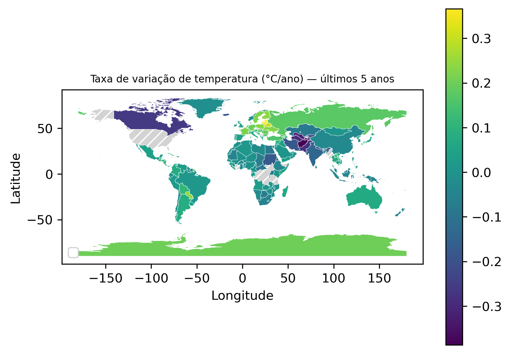

# 🌍🪨 Curso de Verão IAG-USP 2026 - Trabalho Final

<!-- Imagem renderizada no topo (recomendado versionar em assets/) -->
<p align="center">
  
</p>

<p align="center">
  
  
  
  
  
  <!-- DOI (Zenodo): substitua o link/badge quando você criar o depósito no Zenodo -->
  <a href="https://zenodo.org/">
    
  </a>
</p>

Projeto desenvolvido no contexto do **Curso de Verão do IAG-USP (2026)** para demonstrar um workflow científico **reprodutível**: download de dados, processamento, geração de figuras (incluindo **mapa mundial**) e compilação automática de um artigo em LaTeX — tudo com um único comando.

---

## 🧭 Visão geral

✅ O que este repositório faz:

- 📦 Baixa dados de temperatura (automático)  
- 📊 Calcula a taxa de variação recente (°C/ano) por país  
- 📈 Gera um gráfico com **extremos** (maiores e menores variações)  
- 🌍 Gera um **mapa-múndi** com escala de cores (GeoPandas + Matplotlib)  
- 🧾 Gera variáveis LaTeX automaticamente (ex.: `\NPaises`, extremos)  
- 🧱 Compila o artigo em PDF com **Tectonic**  

---

## 🗂 Estrutura do projeto

```
code/                 → scripts Python e Bash
paper/                → artigo em LaTeX
paper/variaveis/       → variáveis geradas automaticamente (não versionadas)
figuras/              → figuras geradas automaticamente (não versionadas)
resultados/           → saídas intermediárias (não versionadas)
dados/                → dados baixados automaticamente (não versionados)
dados/base/           → base cartográfica (GeoJSON) baixada automaticamente
assets/               → imagens para o README (versionadas: PNG/GIF)
Makefile              → orquestra todo o workflow
INSTALL.md            → instalação (macOS)
```

> 💡 Recomendação: **versione** apenas imagens do README em `assets/` (ex.: `assets/mapa_variacao.png` e `assets/mapa_variacao.gif`).  
> As figuras geradas pelo pipeline (`figuras/`) podem continuar fora do Git (via `.gitignore`).

---

## 🔁 Diagrama do workflow (reprodutibilidade)

```text
          ┌──────────────────────┐
          │  code/baixa_dados.py  │
          └───────────┬──────────┘
                      │
                      ▼
          ┌──────────────────────────────┐
          │ resultados/variacao_*.csv     │  ← code/variacao_temperatura.py
          └───────────┬──────────────────┘
                      │
          ┌───────────┴───────────────────────────┐
          ▼                                       ▼
┌───────────────────────┐              ┌────────────────────────┐
│ figuras/taxas_*.png    │              │ figuras/mapa_*.png      │
│ ← code/plota_dados.py  │              │ ← code/gera_mapa.py     │
└───────────┬───────────┘              └───────────┬────────────┘
            │                                      │
            └───────────┬──────────────────────────┘
                        ▼
          ┌──────────────────────────────┐
          │ paper/variaveis/*.tex         │  ← code/conta_dados.sh
          └───────────┬──────────────────┘
                      ▼
          ┌──────────────────────────────┐
          │ paper/paper.pdf              │  ← Tectonic
          └──────────────────────────────┘
```

---

## 🚀 Como reproduzir

### 1) Instale as dependências (macOS)
Siga o passo-a-passo em **[`INSTALL.md`](INSTALL.md)**.

### 2) Gere tudo
```bash
make
```

### 3) Abra o PDF
```bash
make view
```

---

## 🗺️ Mapa no README (PNG + GIF)

Você pode destacar o mapa também como **GIF** (útil para apresentações/portfólio):

<p align="center">
  
</p>

### Como gerar o GIF (opcional)
Se você tiver `ImageMagick` instalado, por exemplo:

```bash
# instala (via Homebrew), se necessário: brew install imagemagick
magick -delay 150 -loop 0 assets/mapa_variacao.png assets/mapa_variacao.gif
```

> Se você preferir um GIF animado “de verdade” (ex.: legenda mudando, zoom, etc.), dá para gerar via Python/Matplotlib também.

---

## 🧰 Tecnologias usadas

- 🐍 Python 3.11  
- 📚 NumPy, Pandas  
- 🖼 Matplotlib  
- 🗺 GeoPandas  
- 🧱 GNU Make  
- 🧾 Tectonic (LaTeX)  

---

## 🏛 Contexto acadêmico

Instituto de Astronomia, Geofísica e Ciências Atmosféricas — Universidade de São Paulo (IAG-USP)

- **Instrutor:** Leonardo Uieda — https://www.leouieda.com/ (GitHub: https://github.com/leouieda)  
- **Monitores:**  
  - Arthur Siqueira de Macêdo — https://github.com/arthursmacedo  
  - Yago Moreira Castro — https://github.com/YagoMCastro  

---

## 📌 DOI (Zenodo)

Quando você criar o depósito no Zenodo e conectar ao GitHub, substitua o badge de DOI por um badge real, por exemplo:

```md
[](https://doi.org/10.5281/zenodo.XXXXXXX)
```

---

## ⚖️ Licença

- Código (Python/Bash/Make/LaTeX): **MIT**  
- Texto do artigo/Markdown: você pode manter **CC-BY** (se quiser separar), ou usar MIT para tudo.

---

# 🇬🇧 English version

<p align="center">
  
</p>

<p align="center">
  
  
  
  
  
  <a href="https://zenodo.org/">
    
  </a>
</p>

This repository (IAG-USP Summer Course 2026) demonstrates a **fully reproducible** scientific workflow: data download, processing, figure generation (including a **global map**), and automated LaTeX compilation — all driven by `make`.

## Quickstart

- Install dependencies (macOS): see **`INSTALL.md`**
- Build everything:
  ```bash
  make
  ```
- Open the PDF:
  ```bash
  make view
  ```

## Reproducible workflow

```text
Data → Processing → Results → Figures → LaTeX variables → PDF
```

## Map GIF (optional)

<p align="center">
  
</p>

## DOI (Zenodo)

Replace the DOI badge once you create a Zenodo release:

```md
[](https://doi.org/10.5281/zenodo.XXXXXXX)
```

## License

MIT (code). You may optionally use CC-BY for text.
